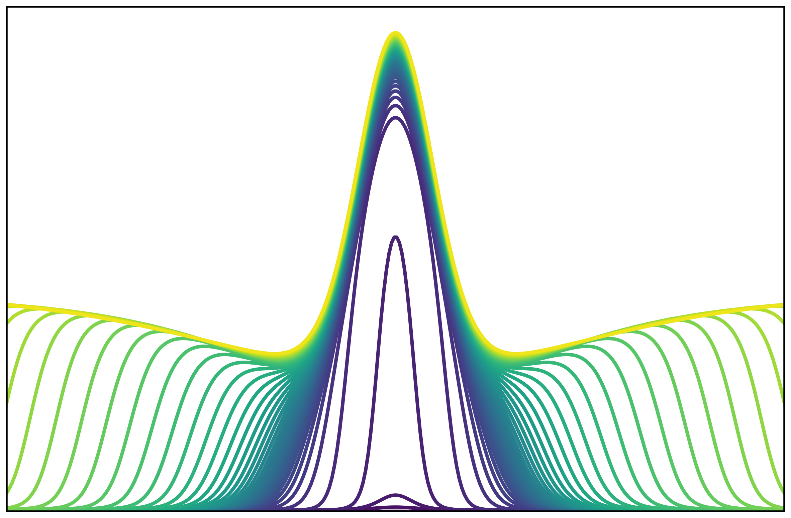

## MSc Thesis in Biophysics & Biochemistry 

# Bistability &amp; Traveling Front Dynamics in the Cell Cycle Regulatory Protein, Aurora B Kinase

**Thesis Manuscript Files:**  
[Main Text](https://github.com/pgovoni21/ABKinase-bistability-traveling-front-dynamics/files/7978798/Govoni_MSc_thesis_main_text.pdf)  
[Supplemental Figures](https://github.com/pgovoni21/ABKinase-bistability-traveling-front-dynamics/files/7978800/Govoni_MSc_thesis_supp_figures.pdf)  
[Supplemental Movies](https://github.com/pgovoni21/ABKinase-bistability-traveling-front-dynamics/files/7987861/Govoni_MSc_thesis_supp_movies.zip)

**Author:** Me, Patrick Govoni  
**Supervisor:** Prof. Lendert Gelens  
**Affiliation:** Department of Cellular and Molecular Medicine, KU Leuven  
**Group:** Dynamics in Biological Systems  
**Academic Year:** 2020-2021 

**Mass-action model taken from:**  
Zaytsev, Anatoly V., et al. "Bistability of a coupled Aurora B kinase-phosphatase system in cell division." elife 5 (2016): e10644.  
[Article](https://github.com/pgovoni21/ABKinase-bistability-traveling-front-dynamics/files/8017486/Zaytsev_2016_ABkinPP_bistability.pdf)

**Jupyter Notebook Files:**  
The following notebooks walk through the simulations of kinase-phosphatase dynamics concerning reaction, diffusion, and localization of Aurora B kinase as described in my thesis. The files mirror the numbered sections of the report, gradually building up the system by:

- [comparing activation & inactivation (positive & negative) feedback loops in the reaction network (4.1)](https://nbviewer.org/github/pgovoni21/ABKinase-bistability-traveling-front-dynamics/blob/main/4_1_activation_inactivation.ipynb)
- [examining the bistability that results from a type of balance between the loops (4.2)](https://nbviewer.org/github/pgovoni21/ABKinase-bistability-traveling-front-dynamics/blob/main/4_2_bistability.ipynb)
- [using both a fully defined mass-action model as well as a simpler phenomenological model (4.3)](https://nbviewer.org/github/pgovoni21/ABKinase-bistability-traveling-front-dynamics/blob/main/4_3_phenomenological_model.ipynb)
- [combining diffusion with bistable reaction kinetics to produce traveling front behavior (6.1)](https://nbviewer.org/github/pgovoni21/ABKinase-bistability-traveling-front-dynamics/blob/main/6_1_diffusion_traveling_fronts.ipynb)
- [relating the model to figures in Zaytsev's paper, finding simulated traveling front behavior only relevant on a much larger scale than observed in vivo (6.3)](https://nbviewer.org/github/pgovoni21/ABKinase-bistability-traveling-front-dynamics/blob/main/6_3_traveling_fronts_mass_action_model_biological_diffusion_speed.ipynb)
- [lowering diffusion speed to observe traveling front behavior relevant to the centromeric localization force, creating an interesting stalling behavior (6.4)](https://nbviewer.org/github/pgovoni21/ABKinase-bistability-traveling-front-dynamics/blob/main/6_4_traveling_fronts_mass_action_model_reduced_diffusion_speed.ipynb)
- [switching to the phenomenological model to the underlying cause of this stalling behavior (6.5)](https://nbviewer.org/github/pgovoni21/ABKinase-bistability-traveling-front-dynamics/blob/main/6_5_traveling_fronts_phenomenological_model.ipynb)
- [describing the stalling via geometric analysis as a transient approach to an energetic equilibrium, or Maxwell point (6.6)](https://nbviewer.org/github/pgovoni21/ABKinase-bistability-traveling-front-dynamics/blob/main/6_6_geometric_analysis_maxwell_point_phenomenological_model.ipynb)
- [moving back to the mass-action model to observe/explain phosphatase as well as kinase dynamics (6.7)](https://nbviewer.org/github/pgovoni21/ABKinase-bistability-traveling-front-dynamics/blob/main/6_7_1_dynamic_kinase_ppase-mass_action_model.ipynb)
- [as well as the effects of fixing phosphatase and of altering the binding site profile on the system (6.7)](https://nbviewer.org/github/pgovoni21/ABKinase-bistability-traveling-front-dynamics/blob/main/6_7_2_dynamic_kinase_ppase-mass_action_model.ipynb)

Note: Several simulations in the report take a significant amount of time to run, as noted in the relevant cells. Due to GitHub file size limits and repository size recommendations, the associated data files have not been uploaded. Feel free to reach out to me if you would like to look at the data without taking the time to run those cells!

## License

Copyright © 2021 [Patrick Govoni](https://github.com/pgovoni21).  
This project is [MIT](https://github.com/pgovoni21/ABKinase-bistability-traveling-front-dynamics/blob/main/LICENSE) licensed.
